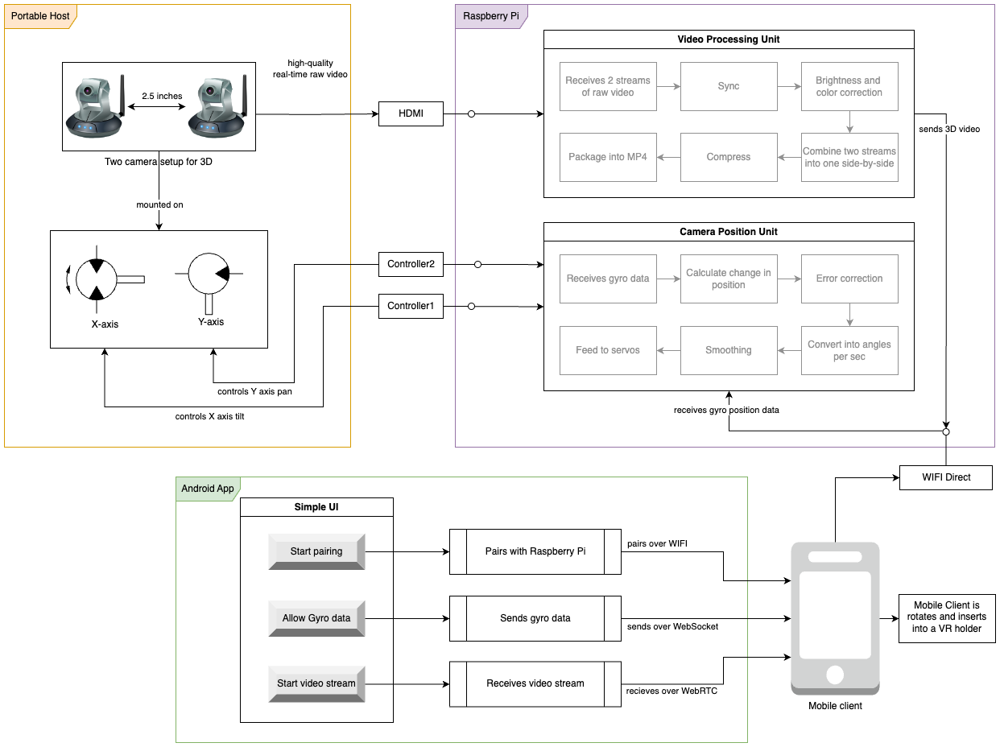

# HeadTrackingFPV
This is part of a project to create an affordable head-tracking system where users can use their phones for both head
tracking sensors and as a VR tools paired with their choice of VR headset.

# Development Setup
This project uses `pipenv` for managing package dependencies and Python environments. Here's how you can set up your 
development environment to start contributing to the project.

## Prerequisites
Before you begin, ensure you have the following installed:
- [Python 3.9](https://www.python.org/downloads/)
- [pip3](https://pip.pypa.io/en/stable/installation/)

### You can follow this to install Python 3.9 in your Raspberry Pi

#### 1. Update and Install Dependencies:
First, update your package list and install necessary dependencies for building Python.
```bash
sudo apt update
sudo apt install -y build-essential tk-dev libncurses5-dev libncursesw5-dev libreadline6-dev libdb5.3-dev libgdbm-dev libsqlite3-dev libssl-dev libbz2-dev libexpat1-dev liblzma-dev zlib1g-dev libffi-dev
```

#### 2. Download Python 3.9 Source:
Go to the /tmp directory and download the Python 3.9 source code.
```bash
cd /tmp
wget https://www.python.org/ftp/python/3.9.13/Python-3.9.13.tar.xz
```

#### 3. Extract and Compile:
Extract the tarball and compile Python. Replace 3.9.x with the exact version number in both commands.
```bash
tar xf Python-3.9.13.tar.xz
cd Python-3.9.13
./configure --prefix=$HOME/.local
make -j 4
make altinstall
```

#### 4. Verify Installation:
Check if Python 3.9 is installed:
```bash
~/.local/bin/python3.9 --version
```

## Installing Pipenv
`pipenv` is a packaging tool for Python that simplifies dependency management. If you don't have `pipenv` installed, 
you can install it using `pip`:
```bash
python3 -m pip install --user pipenv
```

Once pipenv is installed create a virtual environment point to Python 3.9:
```bash
pipenv --python ~/.local/bin/python3.9
```

## Setting Up the Development Environment
Once you have `pipenv` installed, follow these steps to set up your development environment:

1. Clone the repository:
2. Install dependencies using the following command: `python3 -m pipenv install --dev`. This command will install all 
the dependencies required for the project, including the ones needed for development.

## Adding New Dependencies
1. To add a new package: `python3 -m pipenv install packagename`. And for development dependencies: `python3 -m pipenv 
install packagename --dev`. These commands will update the `Pipfile` and `Pipfile.lock` accordingly.
2. Don't forget to update the `requirements.txt` by running `python3 -m pipenv requirements > requirements.txt` 

Happy coding!

## HLD
There are three main components to this design;
1. **Portable Host (aka mechanical components)** that consists of 2 servos and 2 cameras
2. **Raspberry Pi (aka onboard processing unit)** even though physically part of the portable host it considered a 
separate components that does the heavy lifting for sensory and video data processing and streaming
3. **Android App (aka client)** that allows phone to act both as a VR goggle and gyro sensor


This repo is the software that will bring life to the raspberry pi which is the most crucial component of this system.

### Portable Host
Servos connect to the raspberry pi to receive real-time data to control the camera mounted on top of it. Two 
servos connects perpendicular to each other to bring tilt-pan action to the camera. Initial setup most likely will
a single camera simplicity but eventually a 2-camera system should be employed to create a 3D video in the final stage.

### Raspberry Pi
Raspberry Pi handles two-way data processing and streaming
1. From mobile device to servos
2. From cameras to mobile device

#### From mobile device to servos
Gyroscopic data is collected by the `Android App` from the device and sent to the raspberry pi with little to no 
processing. Raspberry pi is responsible for processing the gyro data that is in 3-dimension space into 2 dimensional 
pan-tilt motion.

#### From cameras to mobile device
For starters, a single camera is employed but the goal is to have a 3D setup with 2 cameras. Raspberry pi
synchronizes and processes the video feed and stream it to the `Android App`

### Android App
Android app assists pairing with the `Portable Host`. Once pairing is done, gyro data is collected and send to the 
`Raspberry Pi` and video feed is received.

## Objective
To receive and process sensory data from a mobile phone and process and stream video to the said mobile phone.

## Functional requirements
1. Raspberry Pi is able to wireless-ly pair with the mobile phone
2. Receive gyro data from the mobile device, process and stream it to the servos that control the camera
3. Receive video from cameras and stream it to the mobile device
4. Pull the latest code from GitHub to implement CD pipeline

## Hardware selection
Raspberry Pi 4 is selected for its simplicity in development and usage over Arduino or Raspberry Pi Pico for POC version.
Cameras are Raspberry Pi 4 compatible to provide ease of use. Decision for servos are left open for now.

## Limitations
### Raspberry Pi
1. Requires an OS and can be bulky
2. Requires some work to make it power up from an external battery
3. Requires a CD pipeline inside to assist easy deployment for development cycle

### Cameras
1. Can be difficult to connect two cameras to 1 raspberry pi. This is an open question at the moment

### Servos
1. Servos bought off of Amazon can be too bg or lack stabilization. This decision will be revisited later with Nahid 
Demir.

## Proposed solution

### Webhook for CD
This repo will have a web hook that checks for push events on the master branch to receive the new code

# Open Questions
1. What servo to choose as camera mount?
2. Can 2 cameras connect to 1 Raspberry Pi?